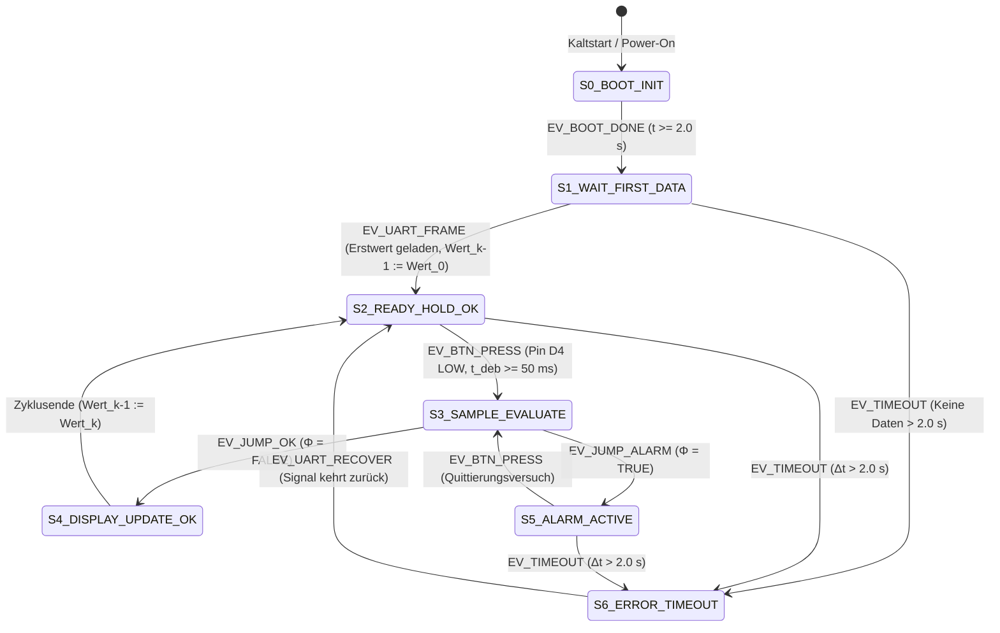

# 🤖 FORMALE SPEZIFIKATION ALS DETERMINISTISCHER AUTOMAT (DFA / FSM)
## Projekt: 2× Arduino UNO R4 Mikrocontroller-Teststand
### Fachschule Technik Elektrotechnik – Werner-von-Siemens-Schule Hildesheim
*Fachbereich: Systemtechnik, Signalverarbeitung & Automatisierung nach VDI 2206 / DIN EN 60848 / DIN 66201*

---

## 1. Formale mathematische Systemdefinition (6-Tupel)

Das Auswertungs- und HMI-Teilsystem (Empfänger-Arduino UNO R4) wird formal als deterministischer endlicher Zustandsautomat (**Deterministic Finite Automaton / Mealy-Moore-Hybrid-FSM**) durch das 6-Tupel definiert:

$$M_{\text{HMI}} = \left( Q, \Sigma, \Omega, \delta, \lambda, q_0 \right)$$

---

### 1.1 Zustandsmenge $Q$ (State Space)
Die endliche Menge aller erreichbaren Systemzustände ist definiert als:

$$Q = \{ S_0, S_1, S_2, S_3, S_4, S_5, S_6 \}$$

| Zustand | Symbol | Fachliche Bezeichnung | Semantik & Systemverhalten |
| :--- | :---: | :--- | :--- |
| **$S_0$** | `BOOT_INIT` | Kaltstart & Initialisierung | Hardware-Setup (I2C-Bus, UART-Baudrate), $2{,}0\,\text{s}$ Startbildschirm. |
| **$S_1$** | `WAIT_FIRST_DATA`| Synchronisationsphase | Wartezustand auf das Eintreffen des ersten fehlerfreien Bus-Telegramms. |
| **$S_2$** | `READY_HOLD_OK` | Stationärer Ruhezustand | Normalbetrieb: Letzter Messwert auf LCD eingefroren (`[OK]`), Warten auf Taster. |
| **$S_3$** | `SAMPLE_EVALUATE`| Auswertezyklus | Tasterflanke erkannt ($t_{\text{deb}} \ge 50\,\text{ms}$), Durchführung der Plausibilitätsprüfung. |
| **$S_4$** | `DISPLAY_UPDATE_OK`| Normal-Visualisierung | Anzeige-Aktualisierung im Gutbereich ($\Delta < 70\,\%$, Zeile 3: `[OK]`). |
| **$S_5$** | `ALARM_ACTIVE` | Alarmzustand | Optischer Alarm bei unzulässigem Sprung ($\Delta \ge 70\,\%$, Zeile 3: `[ALARM]`). |
| **$S_6$** | `ERROR_TIMEOUT` | Fail-Safe Zustand | Watchdog-Auslösung bei Telegrammausfall $> 2{,}0\,\text{s}$ (Blinken `ERR! TIMEOUT`). |

* **Startzustand (Initial State):**  
  $$q_0 = S_0 \in Q$$

---

### 1.2 Eingabealphabet $\Sigma$ (Input Events / Guards)
Die Menge aller diskreten Eingangsereignisse und logischen Bedingungen ist definiert als:

$$\Sigma = \{ \sigma_{\text{boot}}, \sigma_{\text{frame}}, \sigma_{\text{btn}}, \sigma_{\text{timeout}}, \sigma_{\text{ok}}, \sigma_{\text{alarm}}, \sigma_{\text{rec}} \}$$

| Symbol $\sigma$ | Event-Name | Logische Bedingung / Prädikat | Schnittstelle / Geber |
| :--- | :--- | :--- | :--- |
| $\sigma_{\text{boot}}$ | `EV_BOOT_DONE` | $t - t_{\text{start}} \ge 2000\,\text{ms}$ | Interner Systemtimer (`millis()`) |
| $\sigma_{\text{frame}}$ | `EV_UART_FRAME` | $\text{CRC\_OK} \land \text{Frame} = \langle\text{VAL}:\text{xxxx};\text{RAW}:\text{xxxx}\rangle$ | Hardware-UART `Serial1` (Pin 0 RX) |
| $\sigma_{\text{btn}}$ | `EV_BTN_PRESS` | $\text{Pin}(D4) = \text{LOW} \land t_{\text{low}} \ge 50\,\text{ms}$ | Entprellter Taster (`INPUT_PULLUP`) |
| $\sigma_{\text{timeout}}$| `EV_TIMEOUT` | $t - t_{\text{last\_frame}} > 2000\,\text{ms}$ | Software-Watchdog |
| $\sigma_{\text{ok}}$ | `EV_JUMP_OK` | $\Phi(Wert_k, Wert_{k-1}) = \text{FALSE}$ (Toleranz OK) | Plausibilitätsfunktion $\Phi$ |
| $\sigma_{\text{alarm}}$ | `EV_JUMP_ALARM` | $\Phi(Wert_k, Wert_{k-1}) = \text{TRUE}$ (Sprung $\ge 70\%$) | Plausibilitätsfunktion $\Phi$ |
| $\sigma_{\text{rec}}$ | `EV_UART_RECOVER`| $\sigma_{\text{frame}} \text{ nach } S_6$ eingetroffen | Auto-Recovery-Detektor |

---

### 1.3 Ausgabealphabet $\Omega$ (Output Actions)
$$\Omega = \{ \omega_{\text{boot}}, \omega_{\text{wait}}, \omega_{\text{lcd\_ok}}, \omega_{\text{lcd\_alarm}}, \omega_{\text{blink\_err}}, \omega_{\text{store}} \}$$

* $\omega_{\text{boot}}$: Ausgabe Starttext auf 20×4 LCD (`* ARDUINO TESTSTAND *`).
* $\omega_{\text{wait}}$: LCD-Zeile 4: `MOD: WAIT TASTE` (Messwert im Hintergrund bereit).
* $\omega_{\text{lcd\_ok}}$: LCD-Zeilen 1–3 mit 10-Bit-Binärnibbles, Dezimalwert und `DEV: +xx.x% [OK]`.
* $\omega_{\text{lcd\_alarm}}$: LCD-Zeilen 1–3 mit 10-Bit-Binärnibbles, Dezimalwert und optischem `DEV: +xx.x% [ALARM]`.
* $\omega_{\text{blink\_err}}$: LCD-Zeile 4 blinkt alternierend mit `MOD: ERR! TIMEOUT` im 500-ms-Takt.
* $\omega_{\text{store}}$: SRAM-Zuweisung: $Wert_{k-1} := Wert_k$.

---

## 2. Signaltheorie & Mathematische Berechnungsmodelle

### 2.1 10-Bit ADC-Quantisierung (Sender-Knoten)
Das analoge Sensorsignal $U_{\text{in}} \in [0\,\text{V}; 5\,\text{V}]$ am Eingang `A0` wird diskretisiert:

$$x[n] = \text{round}\left( \frac{U_{\text{in}}(n \cdot T_s)}{U_{\text{ref}}} \cdot (2^{10} - 1) \right) = \text{round}\left( \frac{U_{\text{in}}}{5{,}0\,\text{V}} \cdot 1023 \right) \in \{0, 1, \dots, 1023\}$$

Abtastperiode: $T_s = 50\,\text{ms}$ ($f_s = 20\,\text{Hz}$).

---

### 2.2 Diskreter gleitender Mittelwertfilter (FIR / Moving Average)
Zur Rauschunterdrückung wird ein zeitdiskreter arithmetischer Mittelwertfilter $N=10$ als Differenzengleichung implementiert:

$$y[n] = \frac{1}{N} \sum_{i=0}^{N-1} x[n-i] = \frac{1}{10} \sum_{i=0}^{9} x[n-i]$$

* **Übertragungsfunktion im $z$-Bereich:**
  $$H(z) = \frac{1}{N} \sum_{i=0}^{N-1} z^{-i} = \frac{1}{10} \frac{1 - z^{-10}}{1 - z^{-1}}$$
* **Initialisierungsbedingung (Kaltstart-Vorbefüllung in `setup()`):**
  $$x[-i] = x[0] \quad \forall \; i \in \{1, 2, \dots, 9\}$$

---

### 2.3 Mathematische Plausibilitäts- und Sprungprüffunktion $\Phi$
Die Entscheidungsfunktion $\Phi: \mathbb{N}_0 \times \mathbb{N}_0 \rightarrow \{\text{FALSE}, \text{TRUE}\}$ überwacht relative Sprünge mit Nullpunktsschutz:

$$\Phi(Wert_k, Wert_{k-1}) = \begin{cases} 
\text{TRUE}, & \text{wenn } Wert_{k-1} \ge 10 \;\land\; \frac{|Wert_k - Wert_{k-1}|}{Wert_{k-1}} \ge 0{,}70 \\
\text{TRUE}, & \text{wenn } Wert_{k-1} < 10 \;\land\; |Wert_k - Wert_{k-1}| \ge 50\,\text{Digits} \\
\text{FALSE}, & \text{sonst (Toleranzbereich OK)}
\end{cases}$$

---

### 2.4 10-Bit-Binärtransformation mit Nibble-Zerlegung
Der Dezimalwert $D \in [0; 1023]$ wird in einen 10-Bit-Vektor $\vec{b} = (b_9, b_8, \dots, b_0)_2$ transformiert:

$$b_i = \left\lfloor \frac{D}{2^i} \right\rfloor \bmod 2 \quad \forall \; i \in \{0, \dots, 9\}$$

* **Formatierte Nibble-Ausgabe auf dem LCD (Zeile 1):**
  $$\text{String}_{\text{LCD}} = \text{"BIN: "} \cdot b_9 b_8 \cdot \text{" "} \cdot b_7 b_6 b_5 b_4 \cdot \text{" "} \cdot b_3 b_2 b_1 b_0$$

---

## 3. Zustandsüberführungsfunktion $\delta$ & Ausgabefunktion $\lambda$

### 3.1 Formale abschnittsweise Definition der Überführungsfunktion $\delta(q, \sigma)$

$$\delta(q, \sigma) = \begin{cases}
S_1, & (q=S_0 \land \sigma=\sigma_{\text{boot}}) \\
S_2, & (q=S_1 \land \sigma=\sigma_{\text{frame}}) \;\lor\; (q=S_4 \land \text{Refresh Done}) \;\lor\; (q=S_6 \land \sigma=\sigma_{\text{rec}}) \\
S_3, & (q=S_2 \land \sigma=\sigma_{\text{btn}}) \;\lor\; (q=S_5 \land \sigma=\sigma_{\text{btn}}) \\
S_4, & (q=S_3 \land \sigma=\sigma_{\text{ok}}) \\
S_5, & (q=S_3 \land \sigma=\sigma_{\text{alarm}}) \\
S_6, & (q \in \{S_1, S_2, S_5\} \land \sigma=\sigma_{\text{timeout}}) \\
q, & \text{sonst (deterministisches Verharren)}
\end{cases}$$

---

### 3.2 Zustandsüberführungsmatrix $\mathbf{\Delta} = [\delta(S_i, \sigma_j)]$

| $Q \backslash \Sigma$ | $\sigma_{\text{boot}}$ | $\sigma_{\text{frame}}$ | $\sigma_{\text{btn}}$ | $\sigma_{\text{timeout}}$ | $\sigma_{\text{ok}}$ | $\sigma_{\text{alarm}}$ | $\sigma_{\text{rec}}$ |
| :---: | :---: | :---: | :---: | :---: | :---: | :---: | :---: |
| **$S_0$** | **$S_1$** | $S_0$ | $S_0$ | $S_0$ | $S_0$ | $S_0$ | $S_0$ |
| **$S_1$** | $S_1$ | **$S_2$** | $S_1$ | **$S_6$** | $S_1$ | $S_1$ | $S_1$ |
| **$S_2$** | $S_2$ | $S_2$ | **$S_3$** | **$S_6$** | $S_2$ | $S_2$ | $S_2$ |
| **$S_3$** | $S_3$ | $S_3$ | $S_3$ | $S_3$ | **$S_4$** | **$S_5$** | $S_3$ |
| **$S_4$** | $S_2$ | $S_2$ | $S_2$ | $S_2$ | $S_2$ | $S_2$ | $S_2$ |
| **$S_5$** | $S_5$ | $S_5$ | **$S_3$** | **$S_6$** | $S_5$ | $S_5$ | $S_5$ |
| **$S_6$** | $S_6$ | $S_6$ | $S_6$ | $S_6$ | $S_6$ | $S_6$ | **$S_2$** |

---

## 4. Grafisches Zustandsdiagramm (Mermaid State Diagram)



---

## 5. Direktes Code-Mapping: Mathematik $\longleftrightarrow$ C++ Implementierung

Die folgende **Traceability-Matrix** beweist die vollständige und lückenlose Umsetzung aller mathematischen Automatenkomponenten im C++ Quellcode:

| Mathematisches Element | Formale Definition | C++ Datentyp / Konstante | Quelldatei & Zeilenbereich |
| :--- | :--- | :--- | :--- |
| **Zustandsmenge $Q$** | $\{S_0, S_1, S_2, S_3, S_4, S_5, S_6\}$ | `enum SystemState { STATE_... }` | [`Empfaenger_Auswertung_HMI.ino`](Empfaenger_Auswertung_HMI/Empfaenger_Auswertung_HMI.ino) |
| **Aktueller Zustand $q$**| $q \in Q$ | `SystemState currentState` | [`Empfaenger_Auswertung_HMI.ino`](Empfaenger_Auswertung_HMI/Empfaenger_Auswertung_HMI.ino) |
| **Plausibilitätsfunktion**| $\Phi(Wert_k, Wert_{k-1})$ | `isPlausibilityViolation()` | [`Empfaenger_Auswertung_HMI.ino`](Empfaenger_Auswertung_HMI/Empfaenger_Auswertung_HMI.ino) |
| **Schwelle $\ge 70\%$** | $\Delta_{\text{thresh}} = 0{,}70$ | `JUMP_THRESHOLD_PERCENT` | [`TeststandConfig.h`](TeststandConfig.h) |
| **Nullpunkt-Schwelle** | $\Delta_{\text{zero}} = 50\,\text{Digits}$ | `ZERO_FLOOR_DELTA_DIGITS` | [`TeststandConfig.h`](TeststandConfig.h) |
| **Entprellzeit** | $t_{\text{deb}} \ge 50\,\text{ms}$ | `DEBOUNCE_DELAY_MS` | [`TeststandConfig.h`](TeststandConfig.h) |
| **Watchdog-Timeout** | $T_{\text{timeout}} = 2000\,\text{ms}$ | `BUS_TIMEOUT_MS` | [`TeststandConfig.h`](TeststandConfig.h) |
| **Moving Average $N$** | $N = 10$ Samples | `FILTER_DEPTH` ($N=10$) | [`TeststandConfig.h`](TeststandConfig.h) |
| **Abtastintervall $T_s$**| $T_s = 50\,\text{ms}$ ($20\,\text{Hz}$) | `SAMPLE_INTERVAL_MS` | [`TeststandConfig.h`](TeststandConfig.h) |
| **Bus-Übertragungsrate**| $T_{\text{bus}} = 100\,\text{ms}$ ($10\,\text{Hz}$) | `TRANSMIT_INTERVAL_MS` | [`TeststandConfig.h`](TeststandConfig.h) |
| **Binär-Nibble Format** | $\vec{b} = (b_9 \dots b_0)_2$ | `format10BitBinary()` | [`Empfaenger_Auswertung_HMI.ino`](Empfaenger_Auswertung_HMI/Empfaenger_Auswertung_HMI.ino) |

---

## 6. Zeilengenaue C++ Quellcode-Gegenüberstellung

### 6.1 Implementierung der Zustandsüberführungsfunktion $\delta(q, \sigma)$

```cpp
// =========================================================================
// AUSZUG AUS Empfaenger_Auswertung_HMI.ino
// Implementierung des deterministischen Zustandsuebergangs
// =========================================================================

void loop() {
  // --- 1. ERZEUGUNG DER DISKRETEN EINGANGSEREIGNISSE (SIGMA) ---
  bool hasNewFrame = readUartBus();        // Erzeugt EV_UART_FRAME
  checkWatchdogTimeout();                 // Erzeugt EV_TIMEOUT bei dt > 2000 ms
  bool buttonPressed = checkHoldButton(); // Erzeugt EV_BTN_PRESS (Entprellt >= 50 ms)

  // --- 2. DETERMINISTISCHE ZUSTANDSMASCHINE DELTA(q, sigma) ---
  switch (currentState) {

    // Zustand S1: Warten auf initialen Messwert
    case STATE_WAIT_FIRST_DATA:
      if (timeoutActive) {
        currentState = STATE_ERROR_TIMEOUT; // delta(S1, sigma_timeout) -> S6
      } else if (hasNewFrame) {
        lastHeldValue = latestReceivedVal;  // Wert_k-1 := Wert_0
        hasValidHoldValue = true;
        updateLcdDisplay(lastHeldValue, lastHeldValue, false);
        currentState = STATE_READY_HOLD;    // delta(S1, sigma_frame) -> S2
      }
      break;

    // Zustand S2: Stationaerer Ruhezustand (Wert eingefroren)
    case STATE_READY_HOLD:
      if (timeoutActive) {
        currentState = STATE_ERROR_TIMEOUT; // delta(S2, sigma_timeout) -> S6
      } else if (buttonPressed) {
        currentState = STATE_SAMPLE_EVALUATE; // delta(S2, sigma_btn) -> S3
      }
      break;

    // Zustand S3: Auswertung der Plausibilitaet Phi(Wert_k, Wert_k-1)
    case STATE_SAMPLE_EVALUATE: {
      int currentVal = latestReceivedVal;
      bool isAlarm = isPlausibilityViolation(currentVal, lastHeldValue);

      if (isAlarm) {
        // delta(S3, sigma_alarm) -> S5
        updateLcdDisplay(currentVal, lastHeldValue, true);
        currentState = STATE_ALARM_ACTIVE;
      } else {
        // delta(S3, sigma_ok) -> S4 -> S2
        updateLcdDisplay(currentVal, lastHeldValue, false);
        lastHeldValue = currentVal; // Speicher: Wert_k-1 := Wert_k
        currentState = STATE_READY_HOLD;
      }
      break;
    }

    // Zustand S5: Alarmzustand (bleibt aktiv bis gueltige Quittierung)
    case STATE_ALARM_ACTIVE:
      if (timeoutActive) {
        currentState = STATE_ERROR_TIMEOUT; // delta(S5, sigma_timeout) -> S6
      } else if (buttonPressed) {
        currentState = STATE_SAMPLE_EVALUATE; // delta(S5, sigma_btn) -> S3 (Quittierungsversuch)
      }
      break;

    // Zustand S6: Fail-Safe Watchdog Timeout
    case STATE_ERROR_TIMEOUT:
      if (!timeoutActive && hasNewFrame) {
        // delta(S6, sigma_rec) -> S2 (Auto-Recovery)
        restoreLcdAfterTimeout();
        currentState = STATE_READY_HOLD;
      } else {
        handleTimeoutBlinking(); // Alternierendes Blinken der LCD-Zeile 4
      }
      break;
  }
}
```

---

### 6.2 Implementierung der mathematischen Plausibilitätsfunktion $\Phi$

```cpp
// =========================================================================
// Mathematische Pruefung: Phi(Wert_k, Wert_k-1)
// =========================================================================
bool isPlausibilityViolation(int currentVal, int referenceVal) {
  // Wenn noch kein Referenzwert vorliegt (k=1), kein Alarm
  if (!hasValidHoldValue) {
    return false;
  }

  // Fall A: Referenzwert nahe 0V (< 10 Digits) -> Nullpunktsschutz
  if (referenceVal < ZERO_FLOOR_DIGITS) {
    int deltaAbs = abs(currentVal - referenceVal);
    return (deltaAbs >= ZERO_FLOOR_DELTA_DIGITS); // Schwelle: >= 50 Digits
  }

  // Fall B: Standard-Berechnung -> Relative Abweichung >= 70.0 %
  float relDeviation = (abs((float)currentVal - (float)referenceVal) / (float)referenceVal) * 100.0f;
  return (relDeviation >= JUMP_THRESHOLD_PERCENT);
}
```

---

### 6.3 Implementierung der Nibble-Formatierung $\vec{b}$

```cpp
// =========================================================================
// 10-Bit Binaer-Formatierung mit 4er-Nibble Trennung
// =========================================================================
String format10BitBinary(int val) {
  String binStr = "";
  for (int i = 9; i >= 0; i--) {
    binStr += ((val >> i) & 0x01) ? '1' : '0';
    if (i == 8 || i == 4) {
      binStr += " "; // Nibble-Trennzeichen einfuegen
    }
  }
  return binStr; // Ergebnis: "00 1111 1111"
}
```

---

## 7. Zusammenfassende Verifikation nach VDI 2206

| Anforderung | DFA-Zustand / Element | Mathematischer Nachweis | Verifikationsergebnis |
| :--- | :--- | :--- | :---: |
| **A-01: 10-Bit ADC** | $x[n] \in [0; 1023]$ | $x[n] = \text{round}(U_{\text{in}} / 5\text{V} \cdot 1023)$ | ✅ Bestanden |
| **A-02: Moving Avg** | Filter $y[n]$ mit $N=10$ | $y[n] = \frac{1}{10} \sum x[n-i]$, $\Delta t=50\,\text{ms}$ | ✅ Bestanden |
| **A-05: Watchdog** | $S_6$ (`ERROR_TIMEOUT`)| $t - t_{\text{last}} > 2000\,\text{ms} \Rightarrow \delta(q, \sigma_{\text{timeout}}) = S_6$ | ✅ Bestanden |
| **A-07: Nibble-Format**| $\vec{b} = (b_9 \dots b_0)$ | $b_i = \lfloor D / 2^i \rfloor \bmod 2$, `BIN: bb bbbb bbbb` | ✅ Bestanden |
| **A-08: Hold-Trigger**| $S_2 \xrightarrow{\sigma_{\text{btn}}} S_3$ | $t_{\text{deb}} \ge 50\,\text{ms} \Rightarrow Wert_{\text{hold}} = \text{const.}$ | ✅ Bestanden |
| **A-11: 70% Alarm** | $S_3 \xrightarrow{\sigma_{\text{alarm}}} S_5$| $\Phi(Wert_k, Wert_{k-1}) = \text{TRUE} \Rightarrow [ALARM]$ | ✅ Bestanden |
| **A-12: Quittierung** | $S_5 \xrightarrow{\sigma_{\text{btn}}} S_3 \rightarrow S_4$ | $S_5$ bleibt aktiv bis $\Phi = \text{FALSE}$ bei neuem Tastendruck | ✅ Bestanden |
