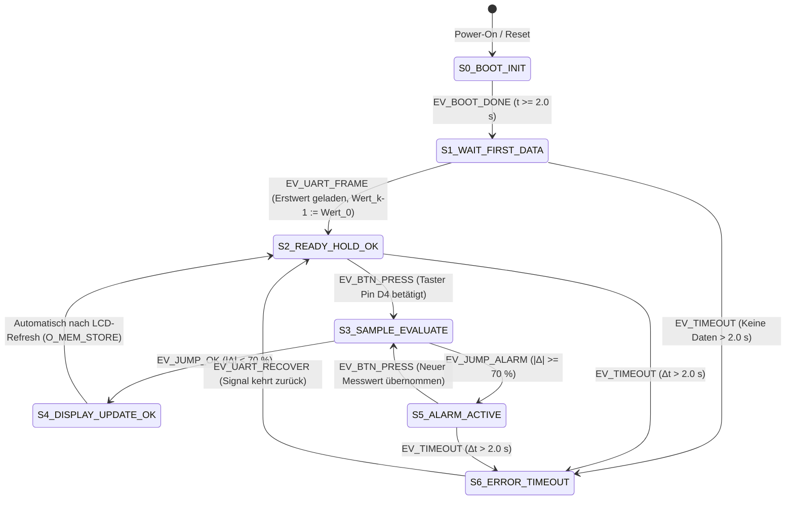

# 🤖 FORMALE SPEZIFIKATION ALS DETERMINISTISCHER AUTOMAT (DFA / FSM)
## Projekt: 2× Arduino UNO R4 Mikrocontroller-Teststand
### Fachschule Technik Elektrotechnik – Werner-von-Siemens-Schule Hildesheim
*Fachbereich: Systemtechnik, Automatisierung & Softwareentwurf nach VDI 2206 / DIN EN 60848 / DIN 66201*

---

## 1. Einführung & Motivation

In der modernen Systemtechnik (VDI 2206) und der sicherheitsgerichteten Softwareentwicklung (z. B. IEC 61508 / ISO 26262) wird das Steuerungs- und Reaktionsverhalten von Mikrocontroller-Systemen formal als **deterministischer endlicher Automat (Deterministische Zustandsmaschine / DFA – Discrete Finite Automaton / FSM)** beschrieben.

### Kernmerkmale eines deterministischen Automaten:
1. **Determiniertheit:** Zu jedem Zeitpunkt befindet sich das System in genau **einem definierten Zustand** $q \in Q$.
2. **Eindeutigkeit der Zustandsübergänge:** Für jeden Zustand $q$ und jedes diskrete Eingabeereignis $\sigma \in \Sigma$ ist der Folgezustand $q' = \delta(q, \sigma)$ mathematisch eindeutig und reproduzierbar festgelegt.
3. **Keine undefinierten Zustände:** Alle Fehlereinflüsse (z. B. Leitungsausfall $>2{,}0\,\text{s}$, Tastenprellen, Division durch Null) werden durch dedizierte Fehler- und Schutzübergänge kontrolliert abgefangen.

---

## 2. Mathematische Formalisierung (6-Tupel Mealy-/Moore-Automat)

Das Auswertungs- und HMI-Teilsystem (Empfänger-Arduino) wird formal durch das 6-Tupel definiert:

$$M_{\text{HMI}} = \left( Q, \Sigma, \Omega, \delta, \lambda, q_0 \right)$$

### 2.1 Zustandsmenge $Q$ (States)
$$Q = \{ S_0, S_1, S_2, S_3, S_4, S_5, S_6 \}$$

* **$S_0$ (`BOOT_INIT`):** Kaltstart-Phase, Hardware-Initialisierung (I2C, UART), $2{,}0\,\text{s}$ Boot-Screen.
* **$S_1$ (`WAIT_FIRST_DATA`):** Wartezustand auf das erste gültige serielle UART-Telegramm (`<VAL;RAW>`).
* **$S_2$ (`READY_HOLD_OK`):** Ruhezustand (Normalbetrieb). Letzter Messwert ist auf dem LCD eingefroren (`[OK]`). Warten auf Taster.
* **$S_3$ (`SAMPLE_EVALUATE`):** Aktiver Auswertezyklus (Taster betätigt, Entprellung $\ge 50\,\text{ms}$, Plausibilitätsberechnung).
* **$S_4$ (`DISPLAY_UPDATE_OK`):** Anzeigeaktualisierung bei plausibler Messung ($\Delta < 70\,\%$, LCD-Zeile 3: `[OK]`).
* **$S_5$ (`ALARM_ACTIVE`):** Alarmzustand bei unplausiblem Signalsprung ($\Delta \ge 70\,\%$, LCD-Zeile 3: `[ALARM]`).
* **$S_6$ (`ERROR_TIMEOUT`):** Fail-Safe Fehlerzustand bei UART-Signalverlust $>2{,}0\,\text{s}$ (LCD blinkt `ERR! TIMEOUT`).

---

### 2.2 Eingabealphabet $\Sigma$ (Inputs / Events)
$$\Sigma = \{ \text{EV\_BOOT\_DONE}, \text{EV\_UART\_FRAME}, \text{EV\_BTN\_PRESS}, \text{EV\_TIMEOUT}, \text{EV\_JUMP\_OK}, \text{EV\_JUMP\_ALARM}, \text{EV\_RESET} \}$$

| Eingabesymbol | Physikalische / Logische Bedingung | Sensor / Schnittstelle |
| :--- | :--- | :--- |
| **`EV_BOOT_DONE`** | Systemzeit $t \ge 2000\,\text{ms}$ nach Kaltstart abgelaufen | Interner Timer (`millis()`) |
| **`EV_UART_FRAME`** | Gültiges Telegramm `<VAL:xxxx;RAW:xxxx>\n` empfangen und geparst | Hardware-UART `Serial1` |
| **`EV_BTN_PRESS`** | Fallende Flanke an Pin `D4` mit stabiler Dauer $t_{\text{press}} \ge 50\,\text{ms}$ | Hold-Taster (`INPUT_PULLUP`) |
| **`EV_TIMEOUT`** | Zeit seit letztem Telegramm $\Delta t_{\text{uart}} > 2000\,\text{ms}$ | Software-Watchdog |
| **`EV_JUMP_OK`** | Sprungberechnung: $\Delta < 70{,}0\,\%$ bzw. $\|\Delta\| < 50\,\text{Digits}$ bei Nullpunkt | Plausibilitäts-Engine |
| **`EV_JUMP_ALARM`** | Sprungberechnung: $\Delta \ge 70{,}0\,\%$ bzw. $\|\Delta\| \ge 50\,\text{Digits}$ bei Nullpunkt | Plausibilitäts-Engine |
| **`EV_UART_RECOVER`**| Erstes gültiges Telegramm nach Timeout eingetroffen | Auto-Recovery-Detektor |

---

### 2.3 Ausgabealphabet $\Omega$ (Outputs / Actions)
$$\Omega = \{ O_{\text{BOOT}}, O_{\text{WAIT}}, O_{\text{SHOW\_OK}}, O_{\text{SHOW\_ALARM}}, O_{\text{BLINK\_ERR}}, O_{\text{MEM\_STORE}} \}$$

* **$O_{\text{BOOT}}$:** Ausgabe Begrüßungstext (`* ARDUINO TESTSTAND *`) auf LCD.
* **$O_{\text{WAIT}}$:** Zeile 4: `MOD: WAIT TASTE` (Messwert im Hintergrund bereit).
* **$O_{\text{SHOW\_OK}}$:** Zeile 1–3 mit Binär-Nibbles, Dezimalwert und `DEV: ±xx.x% [OK]`.
* **$O_{\text{SHOW\_ALARM}}$:** Zeile 1–3 mit Binär-Nibbles, Dezimalwert und optischem `DEV: ±xx.x% [ALARM]`.
* **$O_{\text{BLINK\_ERR}}$:** Zeile 4 blinkt alternierend mit `MOD: ERR! TIMEOUT` im 500-ms-Takt.
* **$O_{\text{MEM\_STORE}}$:** Speichern: $Wert_{k-1} := Wert_k$ im flüchtigen SRAM.

---

## 3. Grafisches Zustandsdiagramm (State Diagram)



---

## 4. Vollständige Zustandsübergangstabelle (Transition Table)

Die Tabelle bildet die deterministische Überführungsfunktion $\delta(q, \sigma) \rightarrow q'$ und die Ausgabefunktion $\lambda(q, \sigma) \rightarrow \Omega$ tabellarisch ab:

| Aktueller Zustand $q$ | Eingangssignal / Event $\sigma$ | Bedingung / Wächter (Guard) | Folgezustand $q'$ | Ausgeführte Aktion $\lambda$ |
| :--- | :--- | :--- | :--- | :--- |
| **$S_0$ (`BOOT_INIT`)** | `EV_BOOT_DONE` | Systemzeit $t \ge 2000\,\text{ms}$ | **$S_1$** (`WAIT_FIRST_DATA`) | Zeige `MOD: WAIT DATA` |
| **$S_1$ (`WAIT_FIRST_DATA`)** | `EV_UART_FRAME` | Gültiges Telegramm empfangen | **$S_2$** (`READY_HOLD_OK`) | Initialisiere $Wert_{\text{ref}} := Wert_{\text{rx}}$, Zeige `MOD: HOLD [TASTE]` |
| **$S_1$ (`WAIT_FIRST_DATA`)** | `EV_TIMEOUT` | Zeit seit Boot $> 2000\,\text{ms}$ ohne Frame | **$S_6$** (`ERROR_TIMEOUT`) | LCD: `MOD: ERR! TIMEOUT` (Blinken) |
| **$S_2$ (`READY_HOLD_OK`)** | `EV_BTN_PRESS` | Flanke LOW an Pin D4 ($t \ge 50\,\text{ms}$) | **$S_3$** (`SAMPLE_EVALUATE`) | Lade $Wert_k := Wert_{\text{rx,aktuell}}$ |
| **$S_2$ (`READY_HOLD_OK`)** | `EV_TIMEOUT` | $\Delta t_{\text{uart}} > 2000\,\text{ms}$ | **$S_6$** (`ERROR_TIMEOUT`) | LCD: `MOD: ERR! TIMEOUT` (Blinken) |
| **$S_3$ (`SAMPLE_EVALUATE`)**| `EV_JUMP_OK` | $\|\Delta_{\text{rel}}\| < 70\,\%$ bzw. $\|\Delta\| < 50$ | **$S_4$** (`DISPLAY_UPDATE_OK`) | Berechne $\Delta\,\%$, LCD-Zeile 3: `[OK]` |
| **$S_3$ (`SAMPLE_EVALUATE`)**| `EV_JUMP_ALARM` | $\|\Delta_{\text{rel}}\| \ge 70\,\%$ bzw. $\|\Delta\| \ge 50$ | **$S_5$** (`ALARM_ACTIVE`) | Berechne $\Delta\,\%$, LCD-Zeile 3: `[ALARM]` |
| **$S_4$ (`DISPLAY_UPDATE_OK`)**| Intern (Zyklusende) | LCD fertig beschrieben ($t_{\text{lat}} \le 100\,\text{ms}$) | **$S_2$** (`READY_HOLD_OK`) | Speicher: $Wert_{k-1} := Wert_k$ |
| **$S_5$ (`ALARM_ACTIVE`)** | `EV_BTN_PRESS` | Neuer Tastendruck an Pin D4 | **$S_3$** (`SAMPLE_EVALUATE`) | Prüfe neuen Wert gegen Vorgänger |
| **$S_5$ (`ALARM_ACTIVE`)** | `EV_TIMEOUT` | $\Delta t_{\text{uart}} > 2000\,\text{ms}$ | **$S_6$** (`ERROR_TIMEOUT`) | LCD: `MOD: ERR! TIMEOUT` (Blinken) |
| **$S_6$ (`ERROR_TIMEOUT`)** | `EV_UART_RECOVER` | Erstes gültiges Telegramm empfangen | **$S_2$** (`READY_HOLD_OK`) | LCD-Fehler löschen, Auto-Recovery |

---

## 5. Teilsystem 1: Sender-Automat (Datenerfassung & Filter)

Auch der Sender-Knoten arbeitet nach einem deterministischen Zeittakt-Automaten:

```mermaid
stateDiagram-v2
    [*] --> A0_INIT : Kaltstart
    A0_INIT --> A1_PREFILL_BUFFER : setup() ADC-Ringpuffer füllen (N = 10)
    A1_PREFILL_BUFFER --> A2_SAMPLING_LOOP : Puffer voll (10 Samples)
    
    state A2_SAMPLING_LOOP {
        [*] --> IDLE_TICK
        IDLE_TICK --> SAMPLE_ADC : Timer dt >= 50 ms (20 Hz)
        SAMPLE_ADC --> UPDATE_MOVING_AVG : Ringpuffer rotieren & Mittelwert berechnen
        UPDATE_MOVING_AVG --> IDLE_TICK
        
        IDLE_TICK --> TRANSMIT_UART : Timer dt >= 100 ms (10 Hz)
        TRANSMIT_UART --> SEND_FRAME : Serial1.print("<VAL:xxxx;RAW:xxxx>\n")
        SEND_FRAME --> IDLE_TICK
    }
```



---

## 6. Code-Mapping: Umsetzung im Arduino C++ Sketch

Der deterministische Automat ist in [`Empfaenger_Auswertung_HMI.ino`](Empfaenger_Auswertung_HMI/Empfaenger_Auswertung_HMI.ino) direkt als `enum` und `switch-case`-Struktur implementiert:

```cpp
// 1. Definition der Zustandsmenge Q
enum SystemState {
  STATE_BOOT_INIT,        // S0: Initialisierung & Boot-Screen
  STATE_WAIT_FIRST_DATA,  // S1: Warten auf ersten Bus-Messwert
  STATE_READY_HOLD,       // S2: Normalbetrieb, Wert gehalten
  STATE_SAMPLE_EVALUATE,  // S3: Taster gedrueckt, Plausibilitaet pruefen
  STATE_ALARM_ACTIVE,     // S5: 70%-Sprungalarm aktiv
  STATE_ERROR_TIMEOUT     // S6: Watchdog-Timeout (> 2.0 s)
};

SystemState currentState = STATE_BOOT_INIT;

// 2. Deterministische Zustandsuebergangsfunktion delta(q, sigma)
void loop() {
  readUartBus();       // Generiert EV_UART_FRAME oder setzt Watchdog zurueck
  checkWatchdog();     // Generiert EV_TIMEOUT bei dt > 2000 ms
  checkButton();       // Generiert EV_BTN_PRESS bei stabiler fallender Flanke

  switch (currentState) {
    case STATE_READY_HOLD:
      if (timeoutFlag) {
        currentState = STATE_ERROR_TIMEOUT;
      } else if (buttonPressedEvent) {
        currentState = STATE_SAMPLE_EVALUATE;
      }
      break;

    case STATE_SAMPLE_EVALUATE:
      // Mathematische Entscheidung: JUMP_OK vs. JUMP_ALARM
      if (isPlausibilityViolation(currentRawVal, lastHeldVal)) {
        updateLcdDisplay(currentRawVal, lastHeldVal, true); // [ALARM]
        currentState = STATE_ALARM_ACTIVE;
      } else {
        updateLcdDisplay(currentRawVal, lastHeldVal, false); // [OK]
        lastHeldVal = currentRawVal;
        currentState = STATE_READY_HOLD;
      }
      break;

    case STATE_ALARM_ACTIVE:
      if (timeoutFlag) {
        currentState = STATE_ERROR_TIMEOUT;
      } else if (buttonPressedEvent) {
        currentState = STATE_SAMPLE_EVALUATE; // Neuer Pruefversuch
      }
      break;

    case STATE_ERROR_TIMEOUT:
      if (!timeoutFlag) {
        // Auto-Recovery bei Signalrueckkehr
        currentState = STATE_READY_HOLD;
        restoreLcdAfterTimeout();
      }
      break;
  }
}
```

---

## 7. Didaktische Zusammenfassung für den Unterricht

1. **Strikte Trennung von Erfassung und Auswertung:**  
   Die Zustandsmaschinen beider Arduinos sind vollständig entkoppelt. Die Kommunikation erfolgt asynchron über das deterministische Telegramm `<VAL;RAW>`.
2. **Prellfreie Flankentriggerung:**  
   Der Übergang `EV_BTN_PRESS` von $S_2 \rightarrow S_3$ wird erst nach Ablauf der Entprellzeit ($t_{\text{deb}} \ge 50\,\text{ms}$) gefeuert $\rightarrow$ Verhindert Mehrfachauslösungen.
3. **Fail-Safe & Liveness:**  
   Der Automat kann in keinem Zustand blockieren (kein `while(1)` oder blockierendes `delay()`). Bei Signalausfall wird immer Zustand $S_6$ erreicht, bei Signalwiederkehr automatisch $S_2$.
