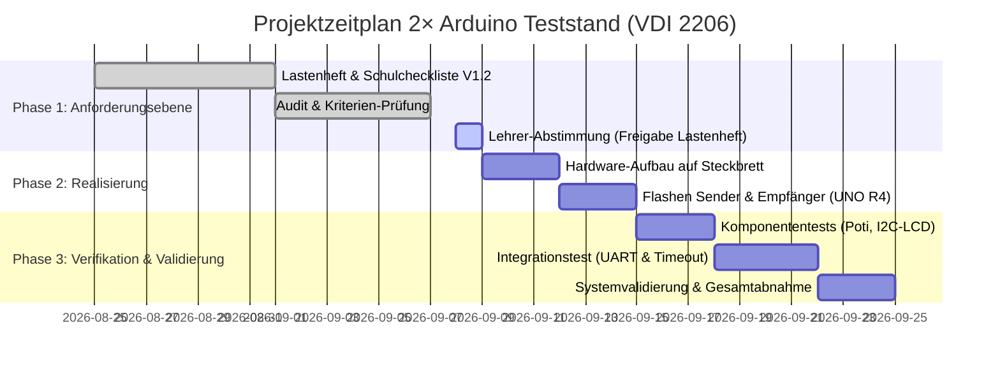

# 🤝 GESPRÄCHSGRUNDLAGE & PROJEKTSTATUS (LEHRERTERMIN)
**Projekt:** Mikrocontroller-Teststand mit 2× Arduino UNO R4 (Datenerfassung, UART-Bus, 70%-Sprungüberwachung & I2C-LCD)  
**Kunde / Prüfer:** Herr Kirchner • Fachschule Technik (Elektrotechnik) – Werner-von-Siemens-Schule Hildesheim  
**Datum des Dokuments:** 07.09.2026 • **Status:** Systemebene abgeschlossen (V1.2 Freigabereif)  

---

## 1. Executive Summary & Zielsetzung des Gesprächs

Ziel des anstehenden Abstimmungsgesprächs ist die **formelle Abnahme des Lastenhefts (Systemebene nach VDI 2206)** sowie die **Freigabe für den physischen Schaltungsaufbau und den anstehenden Integrationstest**.

### Wo stehen wir im V-Modell?
* ✅ **Systemebene (WAS soll das System können?):** Vollständig spezifiziert und auditiert in [Anforderungsspezifikation_Arduino_Teststand.md](Anforderungsspezifikation_Arduino_Teststand.md) sowie der Excel-Matrix [Anforderungsprotokoll_Arduino_Teststand_v1.2.xlsx](Anforderungsprotokoll_Arduino_Teststand_v1.2.xlsx).
* ✅ **Feinentwurf & Simulation:** Vollständige funktionale Vorab-Verifikation über browserbasierte Simulations-Sandboxen ([Teststand_Sandbox_Simulation.html](Teststand_Sandbox_Simulation.html)) und Schaltplanpläne ([Aufbauanleitung_und_Schaltplan.md](Aufbauanleitung_und_Schaltplan.md)).
* ✅ **Firmware:** Bereitgestellte und aufeinander abgestimmte Sketche [Sender.ino](Sender.ino) und [Empfaenger.ino](Empfaenger.ino) mit zentralem Header [TeststandConfig.h](TeststandConfig.h).
* 🎯 **Nächster Meilenstein:** Physischer Aufbau auf dem Labor-Steckbrett und Durchführung der Testfall-Matrix (TC-01 bis TC-07).

---

## 2. Wesentliche neue Erkenntnisse & Medien-Harmonisierung

Aus der Analyse der Schulcheckliste (`Anforderungscheckliste.docx`) und den technischen Anforderungen haben sich fünf zentrale Erkenntnisse ergeben, auf die der gesamte Projektstand angepasst wurde:

```
┌─────────────────────────────────────────────────────────────────────────────────────────────────────────┐
│                                DIE 5 WESENTLICHEN PROJEKT-UPGRADES                                      │
├─────────────────────────────────────────────────────────────────────────────────────────────────────────┤
│ 1. Hardware: Wechsel auf Arduino UNO R4 Minima (Native Serial1 Hardware-Schnittstelle)                  │
│    -> Kein Konflikt mehr zwischen USB-Debugging am PC und dem Inter-Arduino-Bus an Pin 0/1.             │
│                                                                                                         │
│ 2. Telegramm: Erweiterung auf <VAL:xxxx;RAW:xxxx>                                                       │
│    -> Überträgt simultan den geglätteten Mittelwert (Avg) und den ungefilterten Rohwert (Raw).          │
│                                                                                                         │
│ 3. Autonome Timeout-Signalisierung:                                                                     │
│    -> Erkennung von Leitungsbruch (> 2.0 s) schaltet LCD sofort auf 'ERR: COMM TIMEOUT!',                │
│       ohne dass der Bediener zuvor die Hold-Taste drücken muss.                                         │
│                                                                                                         │
│ 4. Nullpunktschutz bei 70%-Grenzwertüberwachung:                                                        │
│    -> Bei Referenzwerten < 10 Digits (nahe 0 V) verhindert eine Mindestdifferenz von Delta >= 50 Digits   │
│       Fehlalarme durch mathematische Division durch Null.                                               │
│                                                                                                         │
│ 5. MBSE & Werkzeug-Interoperabilität (OMG ReqIF 1.0):                                                   │
│    -> Bereitstellung der Anforderungen als .reqif-Datei für Eclipse Capella, DOORS & Polarion.          │
└─────────────────────────────────────────────────────────────────────────────────────────────────────────┘
```

---

## 3. Nachweis-Matrix: Erfüllung der 11 Kriterien der Schulcheckliste

Herr Kirchner legt besonderen Wert auf die Einhaltung professioneller Kriterien aus der Industrie. Hier ist die konkrete Argumentationslinie für das Gespräch:

| Nr. | Kriterium aus Schulcheckliste | Konkrete Umsetzung im Projekt | Nachweisstelle |
| :---: | :--- | :--- | :--- |
| **1** | **Eindeutige Referenzgrößen** (Keine vagen Adjektive wie „schnell“, „hoch“) | Alle Werte besitzen numerische Toleranzen: Abtastung $50\,\text{ms} \pm 2\,\text{ms}$, Latenz $\le 100\,\text{ms}$, Entprellung $\ge 50\,\text{ms}$, Timeout $> 2{,}0\,\text{s}$. | [Anforderungsspezifikation](Anforderungsspezifikation_Arduino_Teststand.md) Kap. 2 |
| **2** | **Atomarität** (Genau eine Aussage je Anforderung) | Strikte Trennung: A-11 regelt rein die *Alarmerkennung*, A-12 rein das *Rücksetzverhalten*. A-08 trennt Hold-Logik von Entprellung. | Lastenheft Matrix A-11 / A-12 |
| **3** | **Eindeutige IDs & Traceability** | Eindeutige Kennungen A-01 bis A-15, lückenlos 1-zu-1 verknüpft mit den Testfällen TC-01 bis TC-07. | [V-MODELL_ARDUINO_TESTSTAND.md](V-MODELL_ARDUINO_TESTSTAND.md) Kap. 3 |
| **4** | **Verständliche Sprache & Glossar** | Verbindliches Glossar definiert alle Schlüsselbegriffe (Moving Average, Hold-Modus, Nibble, Watchdog). | [Anforderungsspezifikation](Anforderungsspezifikation_Arduino_Teststand.md) Kap. 1.3 |
| **5** | **Überprüfbarkeit / Akzeptanzkriterien** | Jede Anforderung definiert ein physikalisch messbares Kriterium (z. B. Linearität $\le \pm 2\,\text{LSB}$ via DMM). | [Anforderungsprotokoll_Arduino_Teststand_v1.2.xlsx](Anforderungsprotokoll_Arduino_Teststand_v1.2.xlsx) |
| **6** | **Begründete Priorisierung** | Klassifizierung nach Muss- (Festforderung `F`) und Kann-Anforderungen (Wunschforderung `W`), priorisiert nach Schutz- und Kernfunktion. | Lastenheft Spalte „Art / Prio“ |
| **7** | **Lösungsneutralität** | Auf Systemebene wird das funktionale Signal- und Busverhalten beschrieben, ohne vorab Chip-Hersteller festzuschreiben. | Lastenheft Kap. 2 |
| **8** | **Widerspruchsfreiheit** | Buszyklus ($10\,\text{Hz} = 100\,\text{ms}$) harmoniert mit Filterabtastung ($20\,\text{Hz} = 50\,\text{ms}$) und Watchdog ($2000\,\text{ms}$). | Systemarchitektur Kap. 1 |
| **9** | **Vollständigkeit** | Einbeziehung von Schutzfunktionen (A-14 Potenzialausgleich GND), Kaltstartverhalten (A-10) und Laborumgebung (A-15). | Lastenheft A-10, A-14, A-15 |
| **10** | **Wartbarkeit & Modularität** | Zentraler Parameter-Header [TeststandConfig.h](TeststandConfig.h); Vorbereitung für bis zu 6 Kanäle (A0–A5). | [TeststandConfig.h](TeststandConfig.h) |
| **11** | **Einhaltung gesetzlicher Normen** | Methodische Ausrichtung nach **VDI 2206** (Mechatronik) und **VDI 2221**; ESD- & Kurzschlussschutz im Labor. | [V-MODELL_ARDUINO_TESTSTAND.md](V-MODELL_ARDUINO_TESTSTAND.md) |

---

## 4. Live-Demonstrations-Leitfaden (3-Minuten-Pitch für den Lehrer)

Für eine beeindruckende Präsentation im Meeting stehen drei interaktive Werkzeuge bereit, die Sie direkt per Doppelklick im Webbrowser vorführen können:

### Schritt 1: Das Systemboard vorstellen (1 Minute)
* **Datei öffnen:** [Physische_Komponenten_Sandbox.html](Physische_Komponenten_Sandbox.html)
* **Erklärung:**  
  *„Herr Kirchner, hier sehen Sie unsere physikalische Topologie: Aufgeteilt in Sender (Datenerfassung mit 10-Bit ADC und Mittelwertbildung) und Empfänger (HMI und Plausibilitätsüberwachung). Beide Baugruppen sind über den seriellen 5V-UART-Bus gekoppelt und besitzen zwingend eine gemeinsame Bezugsmasse (GND).“*

### Schritt 2: Die Live-Simulation demonstrieren (1,5 Minuten)
* **Datei öffnen:** [Teststand_Sandbox_Simulation.html](Teststand_Sandbox_Simulation.html)
* **Aktionen im Browser vorführen:**
  1. **Rauschen einmischen:** Klick auf `Signal-Rauschen: Ein` $\rightarrow$ Im Oszilloskop sieht man, wie der gelbe Rohwert schwankt, während die grüne Mittelwert-Kurve ($N=10$) stabil bleibt.
  2. **Hold-Taste drücken:** Klick auf `TASTER DRÜCKEN` $\rightarrow$ Der Wert friert ein, LCD Zeile 1 zeigt den 10-Bit Binärwert sauber in 4er-Nibbles (`BIN: 00 0110 0100`).
  3. **Plausibilitäts-Alarm testen:** Klick auf den Schnell-Button `+75% ALARM` und danach Taster drücken $\rightarrow$ LCD springt auf `DEV: +75.0% [ALARM!]` (Testfall TC-07).
  4. **Timeout provozieren:** Klick auf `UART-Leitung trennen` $\rightarrow$ Der Watchdog-Balken läuft ab, nach genau $2{,}0\,\text{s}$ schlägt das Display auf `MOD: ERR! TIMEOUT` um. Leitung wieder verbinden $\rightarrow$ Auto-Recovery.

### Schritt 3: Den MBSE- und Standardisierungs-Standard belegen (30 Sekunden)
* **Datei öffnen:** [ReqIF_Grafischer_Viewer.html](ReqIF_Grafischer_Viewer.html)
* **Erklärung:**  
  *„Um das Lastenheft nahtlos in SysML- und MBSE-Entwurfsumgebungen wie Eclipse Capella oder Siemens Polarion übernehmen zu können, haben wir die Spezifikation im internationalen OMG ReqIF 1.0 XML-Standard modelliert.“*

---

## 5. Konkrete Diskussionsfragen & Entscheidungsbedarfe an den Lehrer

Nutzen Sie diese vorbereiteten Fragen, um das Gespräch strukturiert und lösungsorientiert zu leiten:

### Frage 1: Formelle Freigabe von Lastenheft Version 1.2
> *„Herr Kirchner, wir haben die 11 Punkte Ihrer Anforderungscheckliste vollständig in die Version 1.2 unseres Anforderungsprotokolls (`Anforderungsprotokoll_Arduino_Teststand_v1.2.xlsx`) eingearbeitet. Gibt es aus Ihrer Sicht noch offene Punkte, oder können wir das Lastenheft als freigegeben für den Meilenstein 1 betrachten?“*

### Frage 2: Bestätigung des Arduino UNO R4 als Zielplattform
> *„Wir haben die Firmware modular aufgebaut: Auf dem Arduino UNO R4 nutzen wir die native Hardwareschnittstelle `Serial1` an Pin 0/1 für den Inter-Arduino-Bus, wodurch der USB-Port `Serial` uneingeschränkt für das PC-Debugging und den Serial Plotter frei bleibt. Falls die Schule jedoch noch auf UNO R3 setzen möchte, schaltet unser Quellcode über Präprozessor-Weichen automatisch kompatibel um. Ist der UNO R4 für die Laborausstattung freigegeben?“*

### Frage 3: Mechanischer Teststandaufbau (Katalogpunkt OP-07)
> *„Für die Laborabnahme stellt sich die Frage des mechanischen Aufbaus: Reicht für die Bewertung ein übersichtlicher Aufbau auf zwei miteinander gebrückten Labor-Breadboards, oder wird eine feste Montageplatte (z. B. 3D-Druck-Träger oder Acrylglas-Grundplatte) bevorzugt?“*

### Frage 4: Vorgehensweise bei der praktischen Testabnahme
> *„Für die Systemvalidierung auf dem rechten Ast des V-Modells haben wir eine Verifikationsmatrix mit den Testfällen TC-01 bis TC-07 ausgearbeitet (u. a. Kaltstart, Latenzmessung mit 2-Kanal-Oszilloskop, Sprungantworttest). Sollen wir diese Tests als eigenständiges Prüfprotokoll während der Laborstunde gemeinsam gegenzeichnen?“*

---

## 6. Vorbereitete Meilenstein-Planung für die Folgewochen


