# 🔄 PROGRAMMABLAUFPLAN (PAP) / FLIESSDIAGRAMM: SENDER-KNOTEN
## Projekt: 2× Arduino UNO R4 Mikrocontroller-Teststand
### Teilsystem 1: Datenerfassung, Signalfilterung & UART-Busübertragung
*Normative Grundlage: DIN 66001 (Sinnbilder für Datenfluss- und Programmablaufpläne) / DIN EN ISO 5807*

---

## 1. Übersicht & Architektur des Sender-Programms (`Sender.ino`)

Der Datenerfassungs-Arduino (Sender) arbeitet nach dem Prinzip einer **kooperativen, nicht-blockierenden Task-Scheduler-Schleife** ohne `delay()`-Aufrufe. 

Er führt im Wesentlichen zwei asynchrone zyklische Aufgaben aus:
1. **Task 1 (Signalabtastung & Glättung):** Zykluszeit $T_1 = 50\,\text{ms}$ ($20\,\text{Hz}$). Liest den 10-Bit-ADC an Pin `A0` ein und berechnet den gleitenden arithmetischen Mittelwert über einen FIFO-Ringpuffer ($N = 10$).
2. **Task 2 (Zyklische Bus-Übertragung):** Zykluszeit $T_2 = 100\,\text{ms}$ ($10\,\text{Hz}$). Formatiert das ASCII-Telegramm `<VAL:xxxx;RAW:xxxx>\n` und überträgt es über die Hardware-Schnittstelle `Serial1` an den Empfänger-Arduino.

---

## 2. Gesamt-Fließdiagramm (DIN 66001 / Mermaid)

Das folgende Fließdiagramm visualisiert die vollständige Programmlogik von `setup()` über den Kaltstart bis hin zur zyklischen Hauptschleife `loop()`:

```mermaid
flowchart TD
    %% Styling Definitionen
    classDef startEnd fill:#0f766e,stroke:#14b8a6,stroke-width:2px,color:#ffffff;
    classDef process fill:#1e293b,stroke:#38bdf8,stroke-width:1.5px,color:#f8fafc;
    classDef decision fill:#312e81,stroke:#818cf8,stroke-width:2px,color:#ffffff;
    classDef io fill:#1e1b4b,stroke:#a855f7,stroke-width:1.5px,color:#f8fafc;
    classDef subLoop fill:#064e3b,stroke:#10b981,stroke-width:1.5px,color:#ecfdf5;

    Start(["START / Power-On Reset"]):::startEnd --> SetupInit["Setup: Initialisiere Hardware-UART BUS_SERIAL (9600 Baud, 8N1)"]:::process

    SetupInit --> CheckBoard{"Board = Arduino UNO R4?"}:::decision
    CheckBoard -- Ja --> InitDebug["Debug-UART initialisieren: DEBUG_SERIAL.begin(115200)"]:::process
    CheckBoard -- Nein (R3) --> PreFillRead["Erstes Sensor-Sample einlesen: latestRawValue = analogRead(A0)"]:::io
    InitDebug --> PreFillRead

    %% Kaltstart-Vorbefüllung
    subgraph Kaltstart ["Kaltstart-Vorbefüllung (Einschwing-Schutz)"]
        PreFillRead --> InitLoop["Ringpuffer vorbefüllen: for i = 0 bis N-1 (N=10)"]:::subLoop
        InitLoop --> FillArray["readings[i] = latestRawValue\nringTotal += latestRawValue"]:::subLoop
        FillArray --> CalcInitAvg["filteredAverage = ringTotal / 10\nreadIndex = 0"]:::process
    end

    CalcInitAvg --> LoopStart(["Eintritt in loop()"]):::startEnd

    %% Hauptschleife loop()
    LoopStart --> GetMillis["Aktuelle Zeit erfassen: currentMillis = millis()"]:::process

    %% TASK 1: Abtastung & Filterung (20 Hz)
    GetMillis --> CheckSampleTime{"currentMillis - lastSampleTime >= 50 ms ?\n(Abtastzyklus 20 Hz)"}:::decision
    
    CheckSampleTime -- Ja --> Task1_Execute["lastSampleTime = currentMillis"]:::process
    Task1_Execute --> ADC_Read[/"ADC einlesen: latestRawValue = analogRead(A0)"/]:::io
    ADC_Read --> FIFO_Sub["ringTotal -= readings[readIndex] (Ältesten Wert abziehen)"]:::process
    FIFO_Sub --> FIFO_Insert["readings[readIndex] = latestRawValue (Neuen Wert einfügen)"]:::process
    FIFO_Insert --> FIFO_Add["ringTotal += readings[readIndex] (Summe aktualisieren)"]:::process
    FIFO_Add --> FIFO_Inc["readIndex = (readIndex + 1) mod 10 (Zeiger weiterrücken)"]:::process
    FIFO_Inc --> FIFO_Avg["filteredAverage = ringTotal / 10 (Mittelwert berechnen)"]:::process
    FIFO_Avg --> CheckTxTime

    CheckSampleTime -- Nein --> CheckTxTime{"currentMillis - lastTxTime >= 100 ms ?\n(Bus-Sendezyklus 10 Hz)"}:::decision

    %% TASK 2: Bus-Übertragung (10 Hz)
    CheckTxTime -- Ja --> Task2_Execute["lastTxTime = currentMillis"]:::process
    Task2_Execute --> BuildFrame["Telegramm formatieren: snprintf(txBuffer, '<VAL:%04u;RAW:%04u>')"]:::process
    BuildFrame --> UART_Send[/"Telegramm senden: BUS_SERIAL.println(txBuffer)"/]:::io
    UART_Send --> CheckDebug{"Board = UNO R4?"}:::decision
    CheckDebug -- Ja --> PC_Plotter[/"PC-Diagnose via USB: DEBUG_SERIAL.print(Raw, Avg)"/]:::io
    CheckDebug -- Nein --> LoopEnd
    PC_Plotter --> LoopEnd

    CheckTxTime -- Nein --> LoopEnd(["Ende des loop()-Durchlaufs"]):::startEnd
    LoopEnd --> LoopStart
```



---

## 3. Detaillierte Ablauf-Beschreibung nach Phasen

### Phase A: Initialisierung (`setup()`)
```
[Start]
   │
   ├─► 1. Schnittstellen konfigurieren:
   │      • BUS_SERIAL (Serial1 an Pin 0/1) mit 9600 Baud initialisieren.
   │      • Falls UNO R4: USB-Diagnoseport (Serial) mit 115200 Baud starten.
   │
   ├─► 2. Kaltstart-Vorbefüllung des FIFO-Ringpuffers (Vermeidung von Einschwingfehlern):
   │      • Einlesen eines ersten ADC-Werts von Pin A0: latestRawValue = analogRead(A0).
   │      • Befüllen aller 10 Pufferplätze (readings[0..9] = latestRawValue).
   │      • Berechnung der Initialsumme: ringTotal = 10 * latestRawValue.
   │      • Initiale Mittelwertbildung: filteredAverage = ringTotal / 10.
   │      • Ringspeicher-Index auf 0 setzen: readIndex = 0.
   │
   └─► 3. Übergang in die Endlosschleife loop().
```

---

### Phase B: Zyklische Signalabtastung & Glättung (Task 1: alle $50\,\text{ms}$ / $20\,\text{Hz}$)
Erfüllt die Lastenheft-Anforderungen **A-01** (Analoge Eingangserfassung) und **A-02** (Rauschunterdrückung):

$$\Delta t_{\text{sample}} = t_{\text{aktuell}} - t_{\text{letzte\_Abtastung}} \ge 50\,\text{ms}$$

1. **Zeitstempel aktualisieren:** `lastSampleTime = currentMillis;`
2. **Analogwert erfassen:** `latestRawValue = analogRead(A0);` (10-Bit Quantisierung: $0 \dots 1023\,\text{Digits}$).
3. **Subtraktion des ältesten Werts:** `ringTotal -= readings[readIndex];`
4. **Einsetzen des Neuwerts:** `readings[readIndex] = latestRawValue;`
5. **Addition des Neuwerts:** `ringTotal += readings[readIndex];`
6. **Ringzeiger inkrementieren:** `readIndex = (readIndex + 1) % 10;`
7. **Gleitenden Mittelwert berechnen:** 
   $$\bar{x}_k = \frac{1}{10} \sum_{i=0}^{9} x_{k-i} = \left\lfloor \frac{\text{ringTotal}}{10} \right\rfloor$$

---

### Phase C: Zyklische Bus-Telegrammübertragung (Task 2: alle $100\,\text{ms}$ / $10\,\text{Hz}$)
Erfüllt die Lastenheft-Anforderung **A-04** (Zyklische Bus-Datenübertragung):

$$\Delta t_{\text{tx}} = t_{\text{aktuell}} - t_{\text{letzte\_Sendung}} \ge 100\,\text{ms}$$

1. **Zeitstempel aktualisieren:** `lastTxTime = currentMillis;`
2. **ASCII-Framing aufbauen:**  
   `snprintf(txBuffer, sizeof(txBuffer), "<VAL:%04u;RAW:%04u>", filteredAverage, latestRawValue);`  
   *Beispiel:* `<VAL:0512;RAW:0515>\n`
3. **Senden über UART-Bus:** `BUS_SERIAL.println(txBuffer);` (an Empfänger-Arduino Pin 0 RX).
4. **Parallele PC-Diagnose (nur bei UNO R4):**  
   Ausgabe von Tab-separierten Werten `Raw:515\tAvg:512\n` auf der USB-Schnittstelle zur Echtzeit-Darstellung im **Arduino Serial Plotter**.

---

## 4. Code-zu-Diagramm Mapping-Tabelle

| Block im Fließdiagramm | C++ Zeilen in `Sender.ino` | Beteiligte Variablen / Register | Erfüllte Anforderung |
| :--- | :--- | :--- | :--- |
| **UART Setup** | Zeilen 31–36 | `BUS_SERIAL`, `DEBUG_SERIAL` | Systemarchitektur |
| **Puffer-Vorbefüllung** | Zeilen 39–44 | `readings[]`, `ringTotal`, `filteredAverage` | **A-10** (Definierter Kaltstart) |
| **Zeitprüfung Task 1** | Zeile 51 | `currentMillis`, `lastSampleTime`, `SAMPLE_INTERVAL_MS` (50ms) | **A-02** ($20\,\text{Hz}$ Abtastrate) |
| **ADC-Wandlung** | Zeile 54 | `latestRawValue = analogRead(A0)` | **A-01** (10-Bit Erfassung $0 \dots 5\,\text{V}$) |
| **FIFO-Gleitender Mittelwert** | Zeilen 57–62 | `readIndex`, `ringTotal`, `filteredAverage` | **A-02** ($N=10$ Samples Glättung) |
| **Zeitprüfung Task 2** | Zeile 66 | `currentMillis`, `lastTxTime`, `BUS_TX_INTERVAL_MS` (100ms) | **A-04** ($10\,\text{Hz}$ Buszyklus) |
| **Telegramm-Framing & TX** | Zeilen 70–72 | `txBuffer`, `BUS_SERIAL.println(...)` | **A-04** (`<VAL:xxxx;RAW:xxxx>`) |
| **USB-PC Diagnose** | Zeilen 74–80 | `DEBUG_SERIAL.print(...)` | Labor-Diagnose / Serial Plotter |

---

## 5. Zeitliches Ablauf- und Phasen-Diagramm (Timing Waveform)

Da Task 1 ($50\,\text{ms}$) doppelt so häufig wie Task 2 ($100\,\text{ms}$) ausgeführt wird, verarbeitet der Ringpuffer immer genau **zwei frische Messwerte pro übertragenem Bus-Telegramm**:

```text
Zeitachse (ms):   0ms       25ms      50ms      75ms     100ms     125ms     150ms     175ms     200ms
                  │                   │                   │                   │                   │
Task 1 (20 Hz):   ├─ [Sample 1] ─────►├─ [Sample 2] ─────►├─ [Sample 3] ─────►├─ [Sample 4] ─────►├─ [Sample 5]
(ADC & Filter)    │  Raw: 512         │  Raw: 516         │  Raw: 510         │  Raw: 514         │  Raw: 511
                  │  Avg: 512         │  Avg: 513         │  Avg: 512         │  Avg: 513         │  Avg: 512
                  │                   │                   │                   │                   │
Task 2 (10 Hz):   ├─ [Telegramm 1] ───┴──────────────────►├─ [Telegramm 2] ───┴──────────────────►├─ [Telegramm 3]
(UART Bus-TX)     │  <VAL:0512;RAW:0512>                  │  <VAL:0512;RAW:0510>                  │  <VAL:0512;RAW:0511>
                  ▼                                       ▼                                       ▼
```
