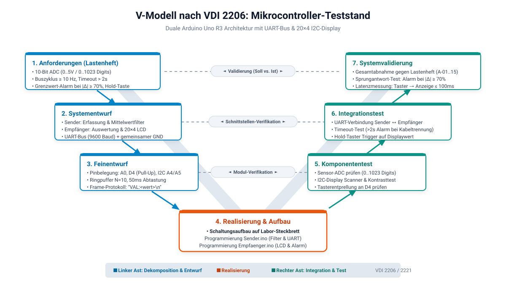
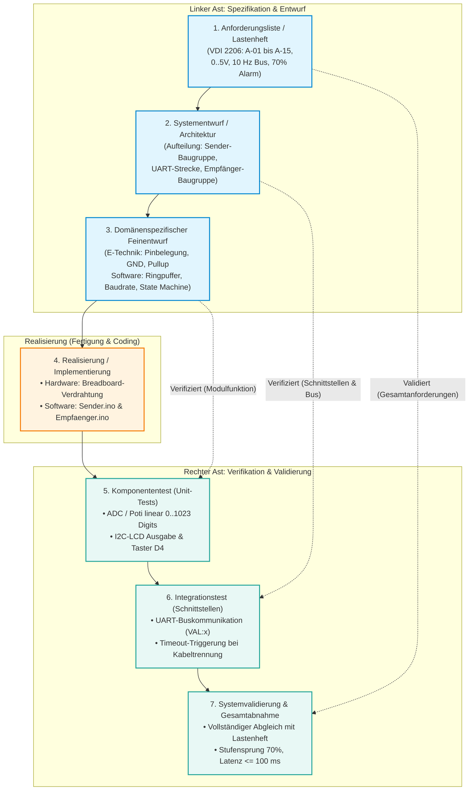

# 📐 V-Modell nach VDI 2206 – Mikrocontroller-Teststand
**Projekt:** Gekoppelter Teststand mit 2× Arduino UNO R4 (Renesas RA4M1, R3/R4-kompatibel), Hardware-UART und 20×4 I2C-LCD  
**Grundlage:** VDI 2206 („Entwicklungsmethodik für mechatronische Systeme“) / VDI 2221  
**Gesprächsleitfaden für Lehrertermin:** [GESPRAECHSGRUNDLAGE_LEHRERTERMIN.md](GESPRAECHSGRUNDLAGE_LEHRERTERMIN.md)  

---

## 1. Übersicht & Grafische Darstellung

Das V-Modell nach VDI 2206 strukturiert den Entwicklungszyklus in zwei wesentliche Äste:
* **Linker Ast (Dekomposition & Entwurf):** Top-Down-Vorgehen – von den übergeordneten Kunden-/Projektanforderungen über das Gesamtsystem bis hin zu den fachdisziplinspezifischen Modulen.
* **Spitze des V (Realisierung):** Praktischer Aufbau der Hardware (Schaltung) und Programmierung der Firmware.
* **Rechter Ast (Integration & Verifikation):** Bottom-Up-Vorgehen – von den isolierten Komponententests über die Systemintegration bis hin zur finalen Abnahme gegen die ursprünglichen Anforderungen.

---

### 1.1 Grafische Übersicht (Vektorgrafik & Infografik)

* **Vektorgrafik (scharf, ohne Tippfehler für Berichte/Word):** [v_modell_vdi2206.svg](v_modell_vdi2206.svg)  
* **Generierte Bilddatei (JPG):** [v_modell_vdi2206.jpg](v_modell_vdi2206.jpg)



---

### 1.2 Interaktives Diagramm (Mermaid)



---

### 1.2 Text-Grafik (ASCII-Übersicht)

```
===================================================================================================
                                      DAS V-MODELL (VDI 2206)
===================================================================================================

[1. ANFORDERUNGSLISTE / LASTENHEFT] ────────────────────────────────► [7. SYSTEMVALIDIERUNG]
  • 10-Bit ADC (0..1023 Digits, 0..5V)       Validierung:               • Abnahme gegen A-01..A-15
  • Zyklus >= 10 Hz, Timeout > 2s          Erfüllt das Gesamtsystem     • 70%-Sprung-Alarmtest
  • Hold-Funktion & LCD 20x4                die Kundenanforderungen?    • Latenzmessung <= 100ms
        \                                                                     ▲
         ▼                                                                   /
    [2. SYSTEMENTWURF / ARCHITEKTUR] ───────────────────────────► [6. INTEGRATIONSTEST]
      • Sender-Arduino (Erfassung/Filter)    Verifikation:          • UART-Busübertragung (9600 Bd)
      • Empfänger-Arduino (HMI/Logik)      Funktionieren die        • Timeout-Erkennung bei Kabelbruch
      • UART-TTL-Bus & gemeinsamer GND     Schnittstellen korrekt?  • Zusammenspiel Sender ↔ Empfänger
            \                                                             ▲
             ▼                                                           /
        [3. DOMÄNENSPEZIFISCHER ENTWURF] ─────────────────────► [5. KOMPONENTENTEST]
          • E-Technik: Pin A0, D4, I2C A4/A5   Verifikation:        • Sensor/Poti einzeln messen
          • Software: Gleitender Mittelwert  Funktionieren Schaltung • LCD einzeln initialisieren
          • Timing: 20 Hz ADC, 50ms Debounce & Modul-Code isoliert? • Tasterentprellung prüfen
                \                                                     ▲
                 ▼                                                   /
                  └──────────────► [4. REALISIERUNG] ───────────────┘
                                   • Breadboard-Aufbau & Verdrahtung
                                   • Programmierung Sender.ino
                                   • Programmierung Empfaenger.ino
===================================================================================================
```

---

## 2. Detaillierte Phasenbeschreibung für den Teststand

### Phase 1: Anforderungsdefinition (Lastenheft / Pflichtenheft)
* **Ziel:** Eindeutige, messbare Festlegung, was das Gesamtsystem leisten muss (VDI 2221 / VDI 2206).
* **Inhalte für den Teststand:**
  * **Messbereich:** 0 bis 5 V analog, Auflösung 10 Bit (0 bis 1023 Digits) an Pin A0 (**A-01**).
  * **Signalverarbeitung:** Gleitender Mittelwertfilter über $N=10$ Werte zur Rauschunterdrückung (**A-02**).
  * **Kommunikation:** Serielle Übertragung mit Mindestübertragungsrate von $f_{\text{bus}} \ge 10\,\text{Hz}$ (**A-04**).
  * **Sicherheit:** Verbindungsüberwachung mit Timeout-Auslösung nach $t > 2\,\text{s}$ (**A-05**).
  * **HMI:** LCD-Display 20×4 via I2C, Darstellung in Binär (Nibble-getrennt), Dezimalwert und Status (**A-06**, **A-07**).
  * **Bedienung:** Display-Wertaktualisierung nur über Hold-Taster mit Entprellzeit $t_{\text{deb}} \ge 50\,\text{ms}$ (**A-08**).
  * **Alarm:** Grenzwertüberwachung bei Sprüngen $|\Delta| \ge 70\,\%$ zum vorherigen Wert (**A-11**).
  * **Elektrik:** Betriebsspannung +5 V DC, zwingend gemeinsames Bezugspotenzial (GND) (**A-14**).

---

### Phase 2: Systementwurf (Grobdesign & Schnittstellenarchitektur)
* **Ziel:** Gliederung des Gesamtsystems in klar abgegrenzte Subsysteme und Festlegung der Schnittstellen.
* **Architekturentscheidungen:**
  1. **Subsystem 1 (Sender-Knoten):** Autarke Messwerterfassung, Filterung und zyklisches Senden. Keine Displaylogik, minimierter Programmcode.
  2. **Subsystem 2 (Empfänger-Knoten):** Autarke Empfangs-, Auswerte- und Anzeige-Einheit. Übernimmt HMI und Überwachung.
  3. **Kommunikationsmedium:** Asynchrone serielle Schnittstelle (UART, 5V TTL, 9600 Baud, 8N1).
  4. **Übertragungsprotokoll:** Klartext-ASCII mit Bezeichner und Zeilenumbruch: `VAL:<Wert>\n` (z. B. `VAL:0512\n`).
  5. **Massebezug:** Verbindung der beiden GND-Pins beider Boards zur Vermeidung von Potenzialverschiebungen.

---

### Phase 3: Domänenspezifischer Feinentwurf (Moduldesign)
In der Mechatronik teilt sich diese Phase typischerweise in **Elektrotechnik**, **Software** und **Konstruktion/Aufbau**:

#### A. Elektrotechnik & Schaltungsdesign
* **Sender:** Potentiometer (10 kΩ) an +5V, GND und Schleifer an Pin A0. Entstörkondensator optional.
* **Empfänger:**
  * I2C-Bus an A4 (SDA) und A5 (SCL) mit Onboard-/Backpack-Pull-up-Widerständen (4,7 kΩ).
  * Hold-Taster zwischen Pin D4 und GND (Nutzung des internen Pull-up-Widerstands `INPUT_PULLUP`, Schaltung schließt gegen Masse).
* **Verbindungsleitung:** TX (Pin 1) des Senders an RX (Pin 0) des Empfängers + GND-GND Brücke.

#### B. Software-Design & Algorithmen
* **Sender-Firmware (`Sender.ino`):**
  * Nicht-blockierende Ablaufsteuerung via `millis()`.
  * Abtasttakt: $t_{\text{sample}} = 50\,\text{ms}$ ($20\,\text{Hz}$).
  * Ringpuffer / gleitender Mittelwert: $N = 10$, arithmetisches Mittel.
  * Sendetakt: $t_{\text{tx}} = 100\,\text{ms}$ ($10\,\text{Hz}$).
* **Empfänger-Firmware (`Empfaenger.ino`):**
  * Serieller Empfangspuffer und Parser für `VAL:`.
  * Watchdog/Timeout-Zähler: `millis() - lastDataTime > 2000`.
  * Tasterentprellung (Software-Debounce, $50\,\text{ms}$).
  * Sprungberechnung: $\text{Abweichung} = \frac{|\text{Wert}_{\text{neu}} - \text{Wert}_{\text{alt}}|}{\max(\text{Wert}_{\text{alt}}, 1)} \cdot 100\,\%$.
  * Formatierungsfunktion: 10-Bit-Binärkonvertierung mit Nibble-Gruppierung (`00 1111 1111`).

---

### Phase 4: Realisierung (Die Spitze des V)
* **Hardware:** Aufbau der Schaltungen auf dem Labor-Steckbrett (Breadboard) mit Verbindungskabeln.
* **Software:** Programmierung, Kompilierung und Hochladen der Sketche [Sender.ino](Sender.ino) und [Empfaenger.ino](Empfaenger.ino) über die Arduino IDE.

---

### Phase 5: Komponententest (Modultests / Unit-Tests)
* **Gegenüberliegende Entwurfsphase:** Phase 3 (Domänenspezifischer Feinentwurf).
* **Prüfungen (isoliert):**
  1. **Sensortest (Sender):** Multimeter an Schleifer von A0 $\rightarrow$ Spannungsbereich $0,00\,\text{V}$ bis $5,00\,\text{V}$ prüfen. Serieller Monitor zeigt Werte von $0$ bis $1023$ Digits.
  2. **Filtertest:** Schnelles Rauschen am Geber $\rightarrow$ Glättungsverhalten im Serial Plotter überprüfen.
  3. **I2C-Test (Empfänger):** I2C-Scanner-Sketch ausführen $\rightarrow$ Bestätigung der Adresse `0x27` (oder `0x3F`). Testtext auf LCD ausgeben.
  4. **Tastertest:** Digital Read an Pin D4 $\rightarrow$ Sicherstellen, dass LOW bei Druck und HIGH bei Ruhezustand anliegt.

---

### Phase 6: Integrationstest (Zusammenspiel & Schnittstellen)
* **Gegenüberliegende Entwurfsphase:** Phase 2 (Systementwurf / Architektur).
* **Prüfungen (im Verbund):**
  1. **UART-Verbindungstest:** TX-Leitung mit RX verbinden $\rightarrow$ Empfänger empfängt kontinuierlich Werte.
  2. **Kommunikationsabbruch (Timeout-Test):** TX-Leitung im laufenden Betrieb abziehen $\rightarrow$ Nach genau $2{,}0\,\text{s}$ muss die Anzeige auf `ERR: COMM TIMEOUT!` umschalten.
  3. **Wiederverbindung:** TX-Leitung wieder anstecken $\rightarrow$ Empfänger kehrt in den normalen Empfangszustand zurück.
  4. **Hold-Taster Integration:** Beim Drücken der Taste D4 muss der aktuelle Live-Wert in den Anzeigewert übernommen werden.

---

### Phase 7: Systemvalidierung (Gesamtabnahme gegen Lastenheft)
* **Gegenüberliegende Entwurfsphase:** Phase 1 (Anforderungskatalog).
* **Prüfungen (Gesamtsystem):**
  1. **Grenzwertalarm (A-11):** Potentiometer schlagartig von $200$ auf über $400$ Digits verstellen und Hold-Taste betätigen $\rightarrow$ Berechnung ergibt $>70\,\% \rightarrow$ LCD Zeile 3 zeigt `[ALARM!]`.
  2. **Normalbereich (A-12):** Geber nur minimal verstellen ($<10\,\%$) $\rightarrow$ LCD zeigt `[OK]`.
  3. **Binärformatierung (A-07):** Wert $1023$ prüfen $\rightarrow$ Anzeige muss exakt `BIN: 11 1111 1111` lauten; Wert $0$ $\rightarrow$ `BIN: 00 0000 0000`.
  4. **Latenz (A-09):** Tasterdruck führt innerhalb von $\le 100\,\text{ms}$ zur optischen Änderung auf dem LCD.
  5. **Abschlussabnahme:** Gegenzeichnen des Abnahmeprotokolls nach VDI 2206.

---

## 3. Verifikations- und Traceability-Matrix

Diese Matrix verknüpft jede Anforderung aus dem Lastenheft direkt mit dem Entwicklungsschritt und der dazugehörigen Testmethode im V-Modell:

| Anforderungs-ID | Spezifikation / Kriterium (WAS) | Phase im linken Ast (Entwurf) | Phase im rechten Ast (Test) | Konkrete Prüfmethode & Nachweis |
| :---: | :--- | :--- | :--- | :--- |
| **A-01** | Analogeingang A0, 10-Bit ADC ($0 \dots 1023\,\text{Digits}$, $0 \dots 5{,}00\,\text{V}$), Linearitätsfehler $\le \pm 2\,\text{LSB}$ | 3. Feinentwurf (Hardware) | 5. Komponententest | Kalibrierte DC-Spannungsquelle & DMM; Abgleich Digits im Serial Monitor |
| **A-02** | Gleitender Mittelwert ($N=10$, $\Delta t=50\,\text{ms} \pm 2\,\text{ms}$, $20\,\text{Hz}$) | 3. Feinentwurf (Software) | 5. Komponententest | Sprungantwort im Serial Plotter; Glättung und Zeitintervall verifizieren |
| **A-03** | Systemskalierung (Architektur modular für bis zu 6 Kanäle A0–A5) | 2. Systementwurf | 5. Komponententest | Funktionstest mit bis zu 6 analogen Signalgebern |
| **A-04** | Zyklische Busübertragung ($f_{\text{bus}} \ge 10\,\text{Hz}$, Telegramm `<VAL:xxxx;RAW:xxxx>\n` bei $9600\,\text{Baud}$) | 2. Systementwurf (Serial1) | 6. Integrationstest | Logikanalysator / Oszi an Pin 1 (TX): Telegrammabstand $\le 100\,\text{ms}$ |
| **A-05** | Bus-Timeout-Überwachung ($t > 2{,}0\,\text{s}$, Wiederanlauf $\le 200\,\text{ms}$) | 3. Feinentwurf (Watchdog) | 6. Integrationstest | Trennung der RX/TX-Leitung $\rightarrow$ Display meldet autonom `ERR: COMM TIMEOUT!` |
| **A-06** | LCD-Ansteuerung via I2C (PCF8574, $100\,\text{kHz}$, 20x4 Zeichen) | 3. Feinentwurf (Hardware) | 5. Komponententest | I2C-Scanner-Test (0x27/0x3F); Kontrast- und Adressprüfung |
| **A-07** | Binärdarstellung 10-Bit (`BIN: bb bbbb bbbb` mit Nibble-Trennung) | 3. Feinentwurf (Software) | 7. Systemvalidierung | Sichtprüfung auf LCD für die Werte 0, 511 und 1023 Digits |
| **A-08** | Hold-Taste mit Entprellung ($t_{\text{deb}} \ge 50\,\text{ms}$, Active LOW) | 3. Feinentwurf (E-Tech/SW) | 6. Integrationstest | Prellprüfung am Oszilloskop; Messwert friert ein bis zum nächsten Tastendruck |
| **A-09** | Reaktionszeit / Latenz $t_{\text{lat}} \le 100\,\text{ms}$ | 2. Systementwurf | 7. Systemvalidierung | 2-Kanal-Oszi: Flanke Taster D4 vs. Start Flanke I2C-SCL Paket am Display |
| **A-10** | Definiertes Init-Verhalten (Boot-Screen $2{,}0\,\text{s} \pm 0{,}1\,\text{s}$, Ringpuffer $N=10$) | 3. Feinentwurf (Setup) | 5. Komponententest | Kaltstartprüfung mit Netztrennung; Status: `MOD: WAIT TASTE` |
| **A-11** | Grenzwertalarm bei $|\Delta_{\text{rel}}| \ge 70{,}0\,\%$ bzw. $|\Delta| \ge 50\,\text{Digits}$ bei $<10\,\text{Digits}$ | 3. Feinentwurf (Mathematik) | 7. Systemvalidierung | Geber schlagartig verstellen $\rightarrow$ LCD Zeile 3 zeigt `[ALARM!]` |
| **A-12** | Alarm-Rücksetzung (Bleibt aktiv bis Folgewert im Toleranzbereich $<70\,\%$) | 3. Feinentwurf (Logik) | 7. Systemvalidierung | Stufentest mit Rückkehr in den Nennbereich $\rightarrow$ Status wird wieder `[OK]` |
| **A-13** | Messwert- & Referenzwertpufferung im SRAM zur Laufzeit | 3. Feinentwurf (Software) | 5. Komponententest | Code-Review & Speicher-Trace im AVR/ARM-Debugger |
| **A-14** | Betriebsspannung $+5{,}0\,\text{V} \pm 5\,\%$, zwingende GND-Kopplung ($0{,}0\,\text{V}$) | 3. Feinentwurf (E-Technik) | 5. Komponententest | DMM-Spannungsmessung zwischen beiden Board-GNDs ergibt $0{,}0\,\text{V}$ |
| **A-15** | Betriebsumgebung $+10\,^\circ\text{C} \dots +40\,^\circ\text{C}$, $20\,\% \dots 80\,\%$ r.F., IP20 | 3. Feinentwurf (Labor) | 7. Systemvalidierung | Sicht- und Funktionsprüfung unter Labor- und Schulungsbedingungen |

---


## 4. Formulierungshilfe für Ihren Projektbericht / Ihre Dokumentation

Falls Sie einen Fließtext für Ihre Facharbeit oder Präsentation benötigen, können Sie folgenden Textbaustein verwenden:

> *„Die Entwicklung des Teststands erfolgte methodisch nach dem V-Modell gemäß Richtlinie VDI 2206. Ausgehend von den im System-Anforderungsprotokoll festgelegten Spezifikationen (u. a. 10-Bit-Datenerfassung, zyklische 10-Hz-UART-Übertragung und Grenzwertüberwachung) wurde die mechatronische Gesamtarchitektur in einen Sender- und einen Empfängerknoten aufgeteilt.*  
>  
> *Im domänenspezifischen Feinentwurf wurden die elektrischen Schaltpläne (I2C-Pullups, Tasterbeschaltung, Signalpegel) sowie die Software-Module (gleitender arithmetischer Mittelwert, Entprellung, Frame-Parsing) detailliert ausgearbeitet. Nach der hardwareseitigen Realisierung und Software-Implementierung auf den beiden ATmega328P-Mikrocontrollern schloss sich der Verifikationsast an: Hierbei wurden zunächst die Komponenten (ADC-Erfassung, I2C-LCD) isoliert auf Modulebene verifiziert, anschließend die Schnittstellenkommunikation und Timeout-Watchdogs im Integrationstest geprüft und abschließend die Erfüllung aller Lastenheftforderungen im Rahmen der Systemvalidierung erfolgreich nachgewiesen.“*
